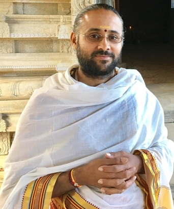

**Pandit Viswanathan Gurukkal** is from Erode. He first served Sri Meenakshi Sundareswarar Temple in Kaspa Pasur, Erode Tamil Nadu.

**Guru**: BrahmaShri K.L.V. Ramana Dixitar & Dr. K. Pitchai Sivachariar

**Education**: [Sri Raja Vedha Kavya Patasala](http://rajavedapatasala.org/), Kumbakonam, Tamil Nadu, India (Established in 1542 A.D)

**Higher Education**: Sri Karpaga Vinayagar Vedhagama Vidhyalayam, Pillayarpatti, Tamil Nadu, India

**Specialization** Vedha Vichakshana, Hindu Religious Course, Krishna Yajur Vedam and Shivaagamam
